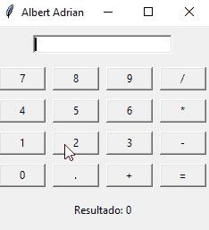

# Calculator GUI (Python + Tkinter)

A simple calculator with a graphical user interface developed in **Python + Tkinter**.  
This project was created to demonstrate skills in event-driven programming, GUI development, and code organization.  

---

## Features
- Numeric keypad (0–9) and operators `+ - * / .`
- Expression evaluation with `eval()`
- Displays the result below the keypad
- Supports pressing Enter to calculate
- Initial focus on the input field for faster typing

---

## Tech Stack
- Python 3.13  
- Tkinter (native Python GUI library)  
- VS Code  
- Git/GitHub  

---

## Demo


---

## Project Structure
```bash
calculator-gui/
├── Calculadora_com_interface.py
├── README.md
