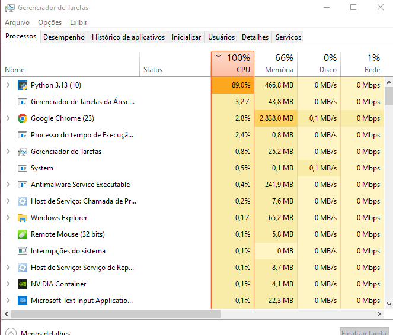

# CPU Stress Test (NumPy)

A minimal CPU stress utility that drives all logical cores close to 100% by multiplying large matrices in parallel using Python, NumPy, and `multiprocessing`. Runtime is fixed to 60 seconds by default to keep results comparable.

## Demo


## Features
- Spawns N processes = number of logical CPU cores
- Warm-up to avoid first-iteration bias
- Fixed 60-second burn (editable in code)
- Iteration timing with approximate GFLOPS
- Works without admin rights; only dependency is NumPy

## Requirements
- Python 3.8+
- NumPy

Install:
```powershell
python -m pip install -U pip numpy
