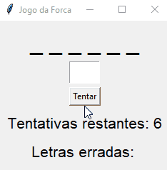

# Hangman GUI (Tkinter)

Simple hangman game with a graphical interface built using **Python + Tkinter**.  
The app picks a random word, you guess letters, and it tracks remaining attempts and wrong guesses.

<p align="center">
  
</p>

---

## Features
- Random word chosen from a predefined list.
- Masked word display that updates as you guess.
- Tracks remaining attempts and wrong letters.
- Submit by button or **press Enter**.
- Automatic reset on win/lose.
- Standard library only: `tkinter`, `random` (plus `messagebox` for dialogs).

---

## Requirements
- Python 3.8+
- Tkinter  
  - Windows/macOS: included with the official Python.
  - Linux:
    - Debian/Ubuntu:
      ```bash
      sudo apt-get update
      sudo apt-get install python3-tk
      ```
    - Fedora:
      ```bash
      sudo dnf install python3-tkinter
      ```
    - Arch:
      ```bash
      sudo pacman -S tk
      ```

---

## How to Run
From the project folder:

```bash
# If you kept the original filename:
python "Forca com interface gráfica.py"

# Recommended (after renaming the file to hangman_gui.py):
python hangman_gui.py
