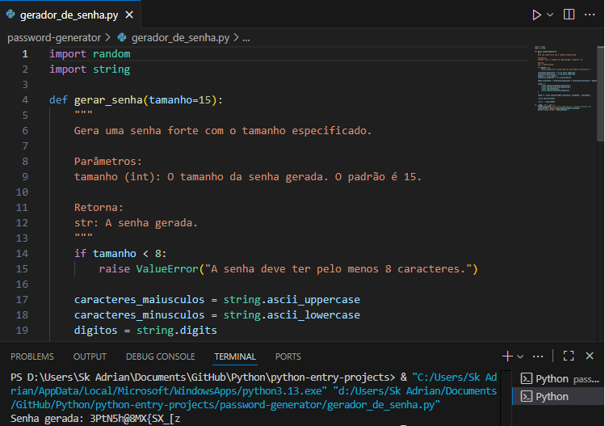

# Password Generator (Python)

A simple password generator written in Python. It creates strong passwords with a configurable length, ensuring at least one uppercase letter, one lowercase letter, one digit, and one special character.

## Demo


## Features
- Length validation: minimum 8 characters (default used in code is 15)
- Guarantees at least 1 uppercase, 1 lowercase, 1 digit, and 1 symbol
- Randomized order to avoid predictable patterns
- Small, dependency-free (standard library only)

## How it works
The function `gerar_senha(tamanho=15)` builds a pool from:
- `string.ascii_uppercase`
- `string.ascii_lowercase`
- `string.digits`
- `string.punctuation`

It first selects one character from each group, fills the remainder with random choices from the full pool, shuffles the list, and joins into a string.

## Requirements
- Python 3.8+

## How to run
From the repository root:
```powershell
cd password-generator
python gerador_de_senha.py
